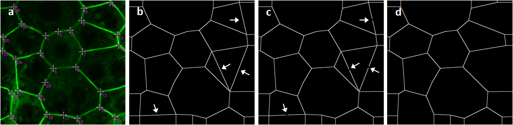
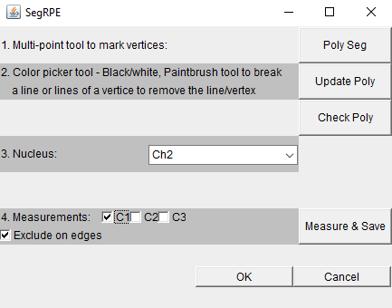
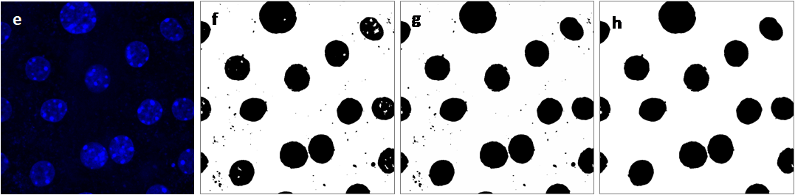

# ImageJ Pluign SegRPE

Plugin SegRPE does cell and nucleus segmentations of RPE imaged by confocal microscopy. 

For cell segmentation of RPE, plugin SegRPE assumes the RPE cells have a polygonal shape. The vertices of the polygons are manually marked and the plugin connects the vertices automatically into polygons. 

Plugin SegRPE runs on the front image loaded onto ImageJ.  Start the plugin and follow the steps described below:

**1.** Use ImageJ Multi-point tool to mark all the vertices of the RPE cells (a). It does not need to be done in a certain order. If a side of a RPE cell is not a straight line, add one or more vertices on it. Click button “Poly Seg”, the plugin will connect the vertices marked with straight lines to form polygons (b).

**2.** The plugin makes a few wrong lines (arrows in (b)). Select Black/white for ImageJ Color picker tool, use ImageJ Paintbrush tool to break the lines (arrows in (c)), and press button “Update Poly”, the wrong lines are removed (d). If there is a wrong vertex marked, break all the lines connected to it. Button “Check Poly” overlays the polygons onto the image to check how well the cell segmentation of RPE is.    

Nucleus segmentation of RPE by plugin SegRPE is completely automatic. The nucleus image (e) is contrast adjusted, median filtered and thresholded (f), and holes filled (g). The residues from the background are removed by size clustering (h); the larger size cluster is nuclei, while the smaller size cluster is from the background.

**3.** If the image includes a nucleus channel, select it.

**4.** Button “Measure & Save” does intensity sums in each segmented cell and its nucleus region for the channels checked, and saves the cell and nucleus segmentations of RPE. 
